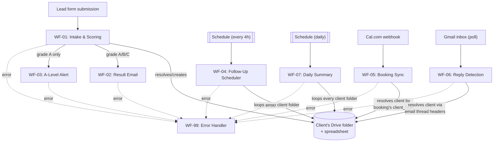
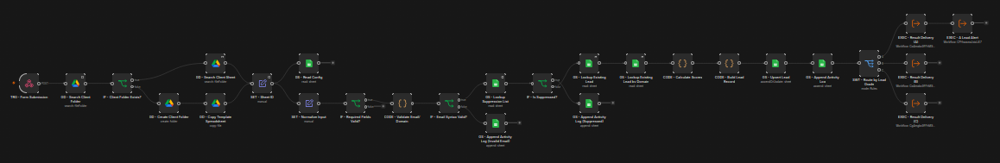

# Lead Magnet Automation

A multi-tenant n8n automation suite for a real estate lead-magnet funnel: a prospect fills out an assessment form, gets scored and routed automatically, and every client (agency) using the system gets their own isolated Google Drive folder and spreadsheet — created on first submission, reused after that.

## How multi-tenancy works

Every incoming lead carries a `type` field identifying which client it belongs to. On first submission, the workflow:

1. Searches the shared **Lead Magnet** Drive folder for a subfolder matching that client name.
2. If none exists, creates the folder and copies a master template spreadsheet into it.
3. Resolves that client's own spreadsheet ID and uses it for every read/write from then on.

Every subsequent workflow (follow-ups, booking sync, reply detection, daily summaries) either receives that spreadsheet ID directly (when triggered by another workflow in the same execution) or re-resolves it independently (when triggered externally — a scheduled run, an inbound email, a booking webhook).

## Workflows

| Workflow | Trigger | Purpose |
|---|---|---|
| **WF-01** — Intake and Scoring | Webhook (`/lead-magnet-intake`) | Validates the submission, resolves/creates the client's Drive folder + spreadsheet, scores the lead (A/B/C), upserts the `Leads` row, routes to WF-02 and (for A-leads) WF-03 |
| **WF-02** — Result Email Delivery | Called by WF-01 | Sends the graded result email via the Gmail API directly (raw MIME), embedding `X-Client-Type`/`X-Client-Sheet-Id` headers on the outbound message so later replies can be traced back to the right client |
| **WF-03** — A-Level Lead Alert and Task | Called by WF-01 (A-grade only) | Alerts the owner and creates a research/contact task with an SLA deadline |
| **WF-04** — Follow-Up Scheduler | Schedule (every 4h) | Loops every client folder, finds leads with a past-due `next_action_at_utc`, sends the appropriate follow-up step email |
| **WF-05** — Booking Sync | Cal.com webhook | Handles `BOOKING_CREATED` / `BOOKING_CANCELLED` / `BOOKING_RESCHEDULED`, resolves the client from the booking's custom `client_type` question, updates the matching lead |
| **WF-06** — Reply Detection and Classification | Gmail inbox poll | Classifies inbound replies (positive, question, referral, negative, not-now, out-of-office, unsubscribe), resolves the client by reading `X-Client-Sheet-Id` off the first message in the email thread, updates the lead and notifies the owner when human follow-up is needed |
| **WF-07** — Daily Management Summary | Schedule (daily) | Loops every client folder, computes a daily performance summary, emails it to that client's owner, and updates their `Dashboard` tab |
| **WF-99** — Error Handler | n8n Error Trigger (global) | Catches failures from every other workflow, classifies severity, logs to a central `Errors` tab, alerts the automation owner for Critical/High severity |

## Client spreadsheet structure

Each client's spreadsheet (a copy of the master template) has these tabs:

- **Leads** — one row per lead, the single source of truth for status, scoring, and next-action scheduling
- **Activity_Log** — an append-only audit trail of every event (submission, email sent, reply received, booking, etc.)
- **Errors** — client-scoped error log (also fed by WF-99 for cross-client visibility)
- **Config** — key/value settings: `OWNER_EMAIL`, `BOOKING_URL`, `A_GRADE_MIN`, `B_GRADE_MIN`, `FOLLOWUP_1/2/3_DAYS`, `LOOM_SLA_HOURS`, `DEFAULT_TIMEZONE`, `SYSTEM_VERSION`
- **Email_Templates** — approved subject/body copy per template ID, with `{{Token}}` placeholders
- **Suppression_List** — emails that have unsubscribed or bounced
- **Dashboard** — one row per day, populated by WF-07
- **Campaigns** — reserved, not currently populated by any workflow

## Setup

1. An n8n instance (self-hosted or cloud) with Google Sheets, Google Drive, and Gmail OAuth2 credentials connected.
2. A root **Lead Magnet** Drive folder, and a master template spreadsheet (matching the tab structure above) inside it — `WF-01`'s `GD - Copy Template Spreadsheet` node clones this for every new client.
3. Import all 8 workflow JSON files into n8n, in the same instance, so the internal `Execute Workflow` references between them resolve correctly.
4. Point each workflow's **Settings → Error Workflow** at `WF-99`.
5. For booking sync: add a custom booking question on your Cal.com event type with identifier exactly `client_type`, and point Cal.com's webhook settings at `WF-05`'s URL, subscribed to `BOOKING_CREATED`, `BOOKING_CANCELLED`, and `BOOKING_RESCHEDULED`.

## Screenshots

<!-- Add screenshots of the n8n canvas for each workflow here, e.g.: -->
<!--  -->

## Status

WF-01, WF-02, WF-03, and WF-06 have been exercised against a live n8n instance across multiple scenarios (all three grade branches, re-submission/upsert, domain-duplicate detection, invalid email, missing consent, multi-client folder creation and reuse, reply classification and client resolution). WF-04, WF-05, WF-07, and WF-99 are built and structurally validated but have not yet had a full live end-to-end test.
